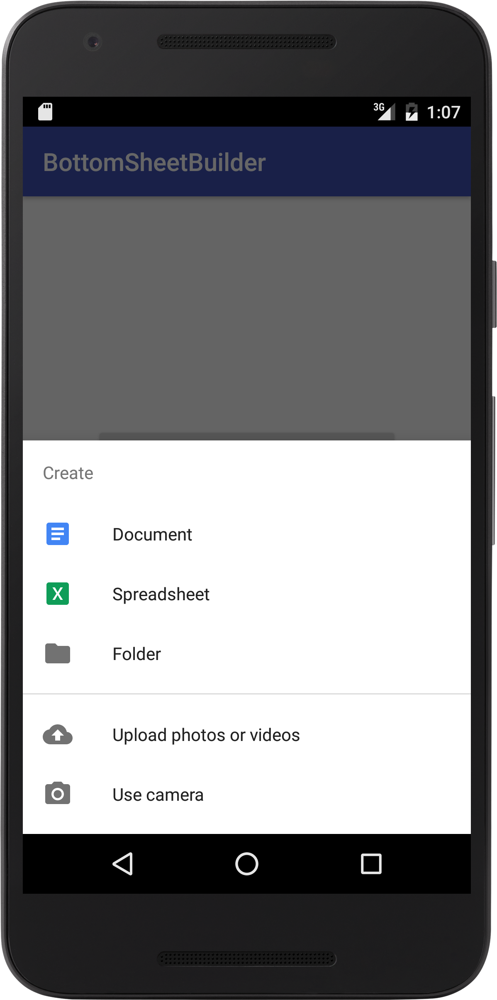
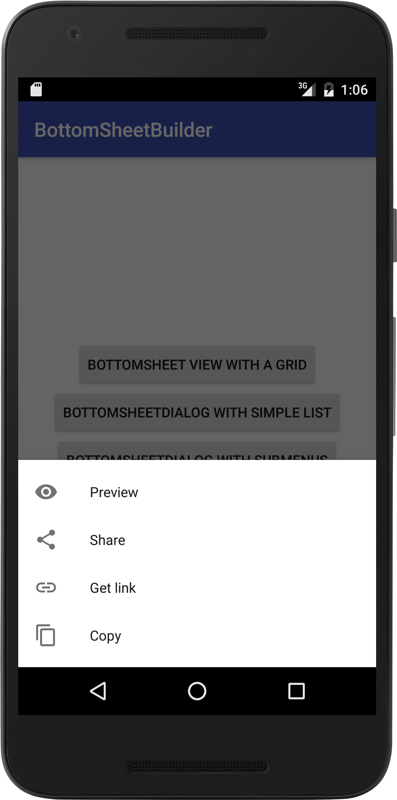
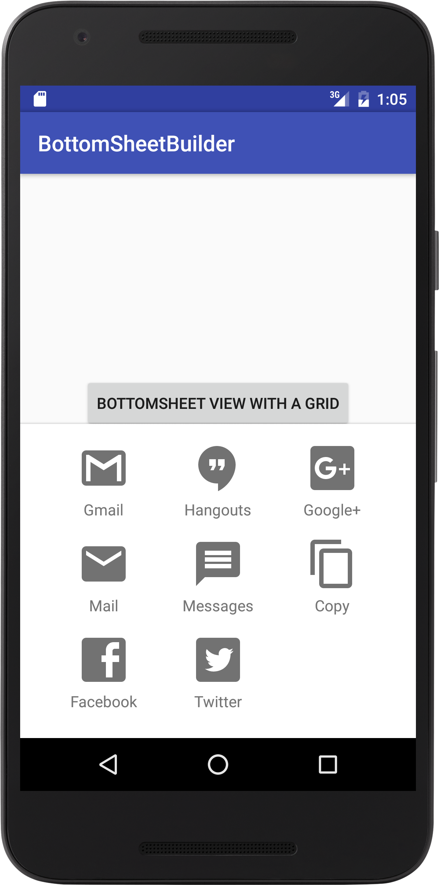

# BottomSheetBuilder
A simple library that creates BottomSheets according to the Material Design specs

Available from API 14.

## Screenshots
 
 

## How to use

- Add the following to your build.gradle:
```groovy
repositories{
  maven { url "https://jitpack.io" }
}

dependencies {
  compile 'com.github.rubensousa:BottomSheetBuilder:1.1'
}
```

- Create a view (the builder already inflates the view inside the coordinatorLayout):
```java
View bottomSheet = new BottomSheetBuilder(context, coordinatorLayout)
        .setMode(BottomSheetBuilder.MODE_GRID)
        .setBackgroundColor(android.R.color.white)
        .setMenu(R.menu.menu_bottom_grid_sheet)
        .setItemClickListener(this)
        .createView();
```
- Create a BottomSheetMenuDialog:
```java
BottomSheetMenuDialog dialog = new BottomSheetBuilder(context, R.style.AppTheme_BottomSheetDialog)
              .setMode(BottomSheetBuilder.MODE_LIST)
              .setBackgroundColor(android.R.color.white)
              .setMenu(R.menu.menu_bottom_simple_sheet)
              .setItemClickListener(new BottomSheetItemClickListener() {
                        @Override
                        public void onBottomSheetItemClick(BottomSheetMenuItem item) {
                                
                        }
                })
              .createDialog();
              
dialog.show();
```

## Styling

Make sure the style passed in the BottomSheetBuilder's constructor extends from Theme.Design.BottomSheetDialog:
```xml
<style name="AppTheme.BottomSheetDialog" parent="Theme.Design.BottomSheetDialog">
    <!-- This changes the overlay background -->
    <item name="android:background">@color/colorAccent</item>
</style>
```
## Sample

The sample includes 3 view modes: grid, list and list with one submenu. Check the screenshots below.

## Customization methods
```java
setItemTextColor(@ColorRes int color)
setTitleTextColor(@ColorRes int color)
setBackground(@DrawableRes int background)
setBackgroundColor(@ColorRes int background)
setDividerBackground(@DrawableRes int background)
setItemBackground(@DrawableRes int background)
```

## Changelog

### 1.1 (19/05/2016)
- Update support library to 23.4.0
- Only add visible menu items

### 1.0 (26/04/2016)
- Update support library to 23.3.0
- Improve dismiss on item click

## Known bugs

There's some bugs that affect the BottomSheetDialog and the BottomSheetBehavior in the Support Library v23.3.0:

- ~~https://code.google.com/p/android/issues/detail?id=201793~~

- https://code.google.com/p/android/issues/detail?id=201825

- ~~https://code.google.com/p/android/issues/detail?id=201826~~

## License

    Copyright 2016 Rúben Sousa
    
    Licensed under the Apache License, Version 2.0 (the "License");
    you may not use this file except in compliance with the License.
    You may obtain a copy of the License at
    
        http://www.apache.org/licenses/LICENSE-2.0
    
    Unless required by applicable law or agreed to in writing, software
    distributed under the License is distributed on an "AS IS" BASIS,
    WITHOUT WARRANTIES OR CONDITIONS OF ANY KIND, either express or implied.
    See the License for the specific language governing permissions and
    limitations under the License.
