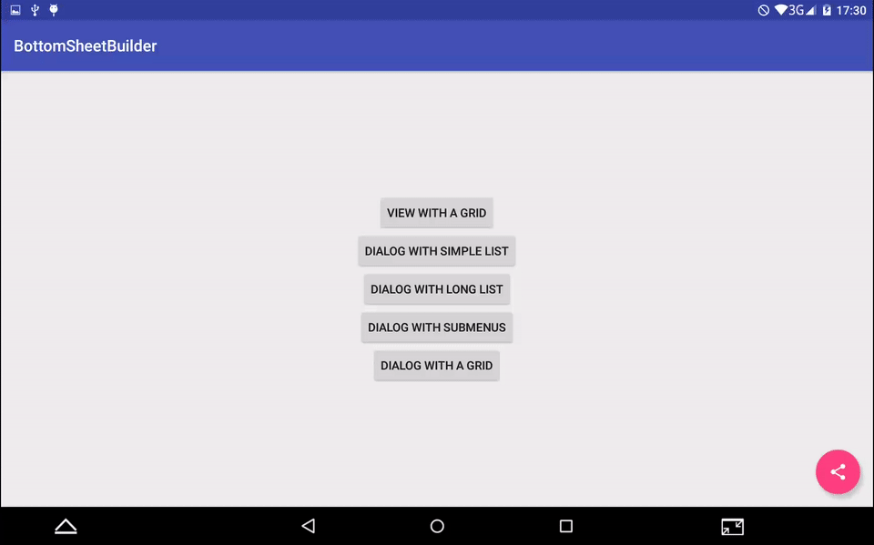
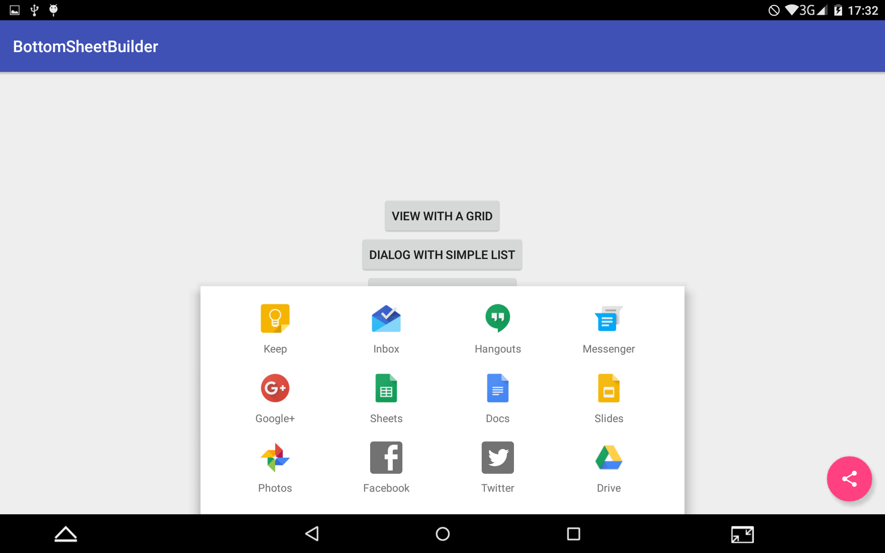

# BottomSheetBuilder
A simple library that creates BottomSheets according to the Material Design specs: https://material.google.com/components/bottom-sheets.html

Available from API 14.

## Screenshots






## How to use

- Add the following to your build.gradle:
```groovy
dependencies {
  implementation 'com.github.rubensousa:bottomsheetbuilder:1.6.1'
  implementation 'com.android.support:design:27.1.1'
}
```

- Create a view (the builder already inflates the view inside the coordinatorLayout):
```java
View bottomSheet = new BottomSheetBuilder(context, coordinatorLayout)
        .setMode(BottomSheetBuilder.MODE_GRID)
        .setBackgroundColor(android.R.color.white)
        .setMenu(R.menu.menu_bottom_grid_sheet)
        .setItemClickListener(this)
        .createView();
```
- Create a BottomSheetMenuDialog:
```java
BottomSheetMenuDialog dialog = new BottomSheetBuilder(context, R.style.AppTheme_BottomSheetDialog)
              .setMode(BottomSheetBuilder.MODE_LIST)
              .setMenu(R.menu.menu_bottom_simple_sheet)
              .setItemClickListener(new BottomSheetItemClickListener() {
                        @Override
                        public void onBottomSheetItemClick(MenuItem item) {
                                
                        }
                })
              .createDialog();
              
dialog.show();
```
- If you have a long view, you should consider adding the AppBarLayout to the builder so that the dialog doesn't overlap with it:

```java
BottomSheetMenuDialog dialog = new BottomSheetBuilder(context, R.style.AppTheme_BottomSheetDialog)
              .setAppBarLayout(appbar)
              ...
```
- If you want to expand the dialog automatically:

```java
BottomSheetMenuDialog dialog = new BottomSheetBuilder(context, R.style.AppTheme_BottomSheetDialog)
              .expandOnStart(true)
              ...
```

- If you want to tint the menu icons:
```java
BottomSheetMenuDialog dialog = new BottomSheetBuilder(context, R.style.AppTheme_BottomSheetDialog)
              .setIconTintColorResource(R.color.colorPrimary)
              ...
```

## Styling

Make sure the style passed in the BottomSheetBuilder's constructor extends from the Theme.Design.BottomSheetDialog family:
```xml
<style name="AppTheme.BottomSheetDialog" parent="Theme.Design.Light.BottomSheetDialog">
    <item name="bottomSheetStyle">@style/AppTheme.BottomSheetStyle</item>
</style>

<style name="AppTheme.BottomSheetStyle" parent="Widget.Design.BottomSheet.Modal">
    <item name="behavior_hideable">true</item>
    <item name="behavior_skipCollapsed">true</item>
</style>
```

You can also style the background and text colors as of 1.5:
```xml
<style name="AppTheme.BottomSheetDialog.Custom" parent="AppTheme.BottomSheetDialog">
    <item name="bottomSheetBuilderItemTextColor">@color/colorPrimaryDark</item>
    <item name="bottomSheetBuilderBackgroundColor">@android:color/white</item>
    <item name="bottomSheetBuilderTitleTextColor">@color/colorAccent</item>
</style>
```
## Sample

The sample includes 4 view modes: grid, list, long list and list with one submenu.
It also has a save/restore state example.

## Customization methods
```java
setItemTextColor(@ColorInt int color)
setTitleTextColor(@ColorInt int color)
setItemTextColorResource(@ColorRes int color)
setTitleTextColorResource(@ColorRes int color)
setIconTintColorResource(@ColorRes int color)
setIconTintColor(int color)
setBackground(@DrawableRes int background)
setBackgroundColorResource(@ColorRes int background)
setBackgroundColor(@ColorInt int background)
setDividerBackground(@DrawableRes int background)
setItemBackground(@DrawableRes int background)
setAppBarLayout(AppBarLayout appbar) -> To avoid overlapping
expandOnStart(boolean expand) -> Defaults to false
```

## Third Party Bindings
  		  
### React Native
You may now use this library with [React Native](https://github.com/facebook/react-native) via the module [here](https://github.com/prscX/react-native-bottom-action-sheet)

## License

    Copyright 2016 Rúben Sousa
    
    Licensed under the Apache License, Version 2.0 (the "License");
    you may not use this file except in compliance with the License.
    You may obtain a copy of the License at
    
        http://www.apache.org/licenses/LICENSE-2.0
    
    Unless required by applicable law or agreed to in writing, software
    distributed under the License is distributed on an "AS IS" BASIS,
    WITHOUT WARRANTIES OR CONDITIONS OF ANY KIND, either express or implied.
    See the License for the specific language governing permissions and
    limitations under the License.
